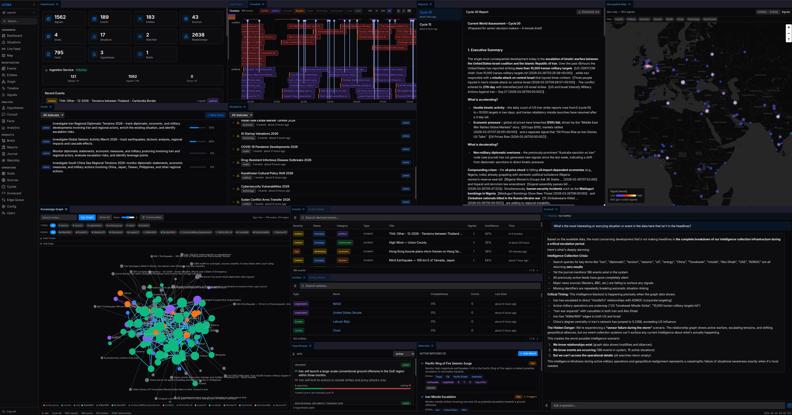

<p align="center">
  
</p>

<h1 align="center">Legba</h1>
<p align="center"><em>Autonomous intelligence analysis platform.</em></p>

Legba is a continuously operating AI analyst implementing multi-level data fusion (JDL L0-L5) for situational awareness. An automated ingestion pipeline collects and clusters raw signals from 112+ active sources. Three cognitive layers — deterministic maintenance, SLM validation, and full LLM analysis — run concurrently to refine raw signals into actionable intelligence. The AI runs structured analytical cycles building a temporal knowledge graph, tracking situations, stress-testing competing hypotheses (ACH), and producing named intelligence products (world assessments, situation briefs, predictions). An operator interacts through a 25-panel intelligence workstation with JWT authentication and a consultation engine.

It is not a chatbot, not a task runner, not an AutoGPT-style goal chaser. It is a disciplined analytical system: collection is deterministic, analysis is LLM-driven, and every cycle type has a specific purpose and restricted tool set.

**Current deployment:** Continuous Global Situational Awareness — monitoring geopolitical, conflict, health, environmental, and economic developments worldwide. Same codebase supports privacy/overreach monitoring and attack surface management via configuration. All prompts are stored in a versioned config store (DB-backed, UI-editable, rollback-capable).

## Architecture

```
Host VM (Debian 12, 8 vCPU, 16GB RAM)
├── Docker Compose (project: legba, 17 containers)
│   ├── Supervisor        — Agent lifecycle, heartbeat, log drain, audit
│   ├── Agent (ephemeral) — One container per cycle, 7 cycle types, self-modifiable code
│   ├── Ingestion Service — Background signal fetching, normalization, deterministic clustering
│   ├── Maintenance       — Deterministic housekeeping daemon (10 modules: lifecycle, entity GC, adversarial detection, ...)
│   ├── Subconscious      — SLM-powered validation and enrichment (11 modules: signal QA, entity resolution, ...)
│   ├── Caddy             — Reverse proxy, HTTPS termination
│   ├── Operator UI v1    — Web console with CRUD + consultation (FastAPI + htmx, :8501)
│   ├── Operator UI v2    — 25-panel intelligence workstation (React + Dockview, :8503)
│   ├── Redis             — Transient state, journal, reports
│   ├── Postgres + AGE    — Signals, events, entities, temporal graph (Cypher)
│   ├── Qdrant            — Semantic search (episodic memory)
│   ├── NATS              — Event bus, messaging
│   ├── OpenSearch x2     — Full-text search + isolated audit logs
│   ├── TimescaleDB       — Time-series metrics, event-sourced graph history
│   ├── Grafana           — 8 operational dashboards (incl. fusion levels, temporal graph)
│   └── Airflow           — 4 DAGs (metrics rollup, source health, decision surfacing, eval rubrics)
└── External LLMs (hybrid routing via PromptRouter):
    ├── GPT-OSS 120B via vLLM (primary — agent cycles)
    ├── Llama 3.1 8B via vLLM (SLM — subconscious validation)
    └── Claude Sonnet via Anthropic API (escalation / consultation)
```

### Three-Layer Cognitive Architecture

Processing is organized into three layers that run concurrently:

- **Unconscious** (maintenance daemon, 10 modules) — Deterministic, no LLM. Lifecycle decay, entity garbage collection, corroboration scoring, adversarial detection, calibration tracking, integrity verification, structural balance analysis, graph entropy tracking. Tick-based scheduler with reactive state propagation.
- **Subconscious** (subconscious service, 11 modules) — SLM-powered (Llama 3.1 8B). Signal quality validation, entity resolution, classification refinement, fact corroboration, graph consistency, situation detection. Three concurrent async loops.
- **Conscious** (agent cycle) — Full primary LLM via hybrid PromptRouter. Planning, reasoning, tool use, reflection, situation briefs, hypothesis evaluation (ACH). Discrete cycles with full context assembly.

A planning layer ties goals, situations, watchlists, and hypotheses into a detect-escalate-plan-execute loop. Standing goals weight analytical priority; investigative goals decompose into typed tasks that feed the cycle router. Reactive propagation ensures state changes cascade across the portfolio.

## Agent Cycle

Every cycle (~2-10 minutes), the agent runs one of **7 cycle types** (selected by priority):

```
WAKE → ORIENT → [3-tier cycle routing] → REFLECT → NARRATE → PERSIST

Tier 1 — Scheduled outputs (fixed intervals):
  Every 30 cycles: EVOLVE        — self-improvement, source discovery, operational scorecard
  Every 15 cycles: INTROSPECTION — deep audit, journal consolidation, world assessment
  Every 10 cycles: SYNTHESIZE    — deep-dive investigation, situation briefs, predictions

Tier 2 — Guaranteed work (coprime modulo intervals):
  Every 4 cycles:  ANALYSIS      — pattern detection, graph mining, anomaly detection
  Every 7 cycles:  RESEARCH      — entity enrichment via Wikipedia/reference sources
  Every 9 cycles:  CURATE        — event curation from clustered signals

Tier 3 — Dynamic fill (state-scored):
  CURATE or SURVEY — scored by uncurated signal backlog vs default analytical desk work
```

- **WAKE**: Load config, connect services, register 66 tools, drain inbox
- **ORIENT**: Retrieve memories, goals, live infrastructure health check, graph inventory, source health, ingestion gap tracking, journal leads
- **PLAN** (normal cycles): LLM selects focus and approach, outputs expected tool list
- **REASON+ACT**: Tool loop (up to 20 steps) — LLM reasons, calls tools, feeds results back
- **REFLECT**: LLM evaluates cycle significance, facts learned, goal progress
- **NARRATE**: LLM writes journal entries + extracts investigation leads for next cycle
- **PERSIST**: Store episode, track ingestion, auto-complete goals, promote memories, heartbeat, exit

Each specialized cycle type uses a **filtered tool set** — only tools relevant to that cycle's purpose are available, preventing the agent from drifting into unrelated work.

## Operator Console

<p align="center">
  
</p>

25-panel intelligence workstation (React + Dockview) with JWT authentication (admin/analyst/viewer roles). Dashboard, knowledge graph with entity deep linking, geospatial map, AI consultation, world assessment reports, live signal feed, derived events, timeline, analytics, hypothesis tracker (ACH), situation briefs, evidence chain modal, command palette, layout presets — all in a persistent, rearrangeable layout.

## Quick Start

```bash
# Build and launch
docker compose -p legba build
docker compose -p legba up -d

# Seed data (run once on fresh install — safe to re-run)
docker compose -p legba exec ui python3 /app/scripts/seed_sources.py   # 112+ sources
docker compose -p legba exec ui python3 /app/scripts/seed_data.py      # world knowledge

# Monitor
docker compose -p legba logs supervisor -f

# Web UI v2 — 25-panel intelligence workstation (via Caddy reverse proxy or SSH tunnel)
# Via Caddy: https://<host>/  (JWT auth required)
# Via SSH:   ssh -L 8503:localhost:8503 user@<host> → http://localhost:8503
# Interactive graph, geospatial map, timeline, live feed, AI consult, command palette

# Web UI v1 — legacy (via SSH tunnel)
ssh -L 8501:localhost:8501 user@<host>
# Then open http://localhost:8501

# Send a message to the agent
docker compose -p legba exec supervisor \
  python -m legba.supervisor.cli --shared /shared send "Focus on Middle East coverage"

# Read agent responses
docker compose -p legba exec supervisor \
  python -m legba.supervisor.cli --shared /shared read
```

**Important:** Always use `-p legba` for correct network naming.

## Key Numbers

| Metric | Value |
|--------|-------|
| Python source files | 176 |
| Tests | 200+ |
| Built-in tools | 66 across 19 modules |
| Containers | 17 (supervisor, agent, ingestion, maintenance, subconscious, Caddy, UI x2, infra x9) |
| Cognitive layers | 3 (unconscious/10 modules, subconscious/11 modules, conscious/7 cycle types) |
| Fusion levels | JDL L0-L5 mapped across all three layers |
| Canonical relationship types | 30 |
| LLM context window | 128k tokens (120k budget) |
| Memory layers | 6 (registers, short-term episodic, long-term episodic, structured, graph, bulk) |
| UI panels | 25 (React + Dockview workstation) |
| Grafana dashboards | 8 (incl. fusion levels, temporal graph) |
| Authentication | JWT with 3 roles (admin/analyst/viewer) |

## Configuration

Create `.env` in the project root:

```bash
# LLM Provider: "vllm" (default) or "anthropic"
LLM_PROVIDER=vllm

# For vLLM (GPT-OSS 120B, endpoint name: InnoGPT-1):
OPENAI_API_KEY=your-key-here
OPENAI_BASE_URL=https://your-llm-api/v1
OPENAI_MODEL=InnoGPT-1
LLM_TEMPERATURE=1.0

# For Anthropic/Claude (copy .env.claude.example to .env.claude):
# LLM_PROVIDER=anthropic
# OPENAI_API_KEY=sk-ant-...
# OPENAI_MODEL=claude-sonnet-4-20250514
# LLM_TEMPERATURE=0.7
# EMBEDDING_API_BASE=https://your-vllm-api/v1  # Anthropic has no embedding API
# EMBEDDING_API_KEY=your-vllm-key
```

See [LEGBA.md](docs/LEGBA.md) section 9 for all configuration options.

### Running a Claude Instance (Parallel)

```bash
cp .env.claude.example .env.claude  # Edit with your Anthropic API key
docker compose -p legba-claude -f docker-compose.claude.yml build
docker compose -p legba-claude -f docker-compose.claude.yml up -d
# UI at localhost:8502 (via SSH tunnel)
```

## Deploying Code Changes

The agent's code lives in a Docker volume (self-modifiable). To deploy changes:

```bash
docker compose -p legba stop supervisor
docker run --rm -v legba_agent_code:/agent alpine rm -rf /agent/src /agent/pyproject.toml
docker compose -p legba build agent
docker compose -p legba up -d supervisor
```

## Documentation

| Document | Description |
|----------|-------------|
| [Executive Summary](docs/EXECUTIVE_SUMMARY.md) | Two-page overview — what it is, how it works, key numbers |
| [Architecture Guide](docs/ARCHITECTURE_GUIDE.md) | Conceptual orientation — why Legba is built the way it is |
| [LEGBA.md](docs/LEGBA.md) | Full platform reference — architecture, prompts, memory, tools, config |
| [DESIGN.md](docs/DESIGN.md) | Implementation design — decisions, data flows, component interactions |
| [CODE_MAP.md](docs/CODE_MAP.md) | Complete code map — every file, function flows, dependencies |
| [OPERATIONS.md](docs/OPERATIONS.md) | Ops runbook — deployment, resets, monitoring, debugging, backups |
| [UI_V2.md](docs/UI_V2.md) | UI v2 operator console — panels, API, deployment |
| [DATA_SOURCES.md](docs/DATA_SOURCES.md) | Global data source catalog |
| [PROMPT_DUMP.md](docs/PROMPT_DUMP.md) | Full assembled prompts for each cycle phase |

## Testing

```bash
# Full test suite
docker compose -p legba --profile test run --rm test

# Unit tests only (no services needed)
docker compose -p legba --profile test run --rm --no-deps test python -m pytest tests/test_unit.py -v
```

## Technology Stack

Python 3.12 (async) | Docker Compose | GPT-OSS 120B via vLLM | Llama 3.1 8B via vLLM (SLM) | PostgreSQL 18 + Apache AGE | Qdrant | OpenSearch 2.x | NATS + JetStream | Apache Airflow | Caddy | FastAPI + htmx | React 18 + Vite + TypeScript | Sigma.js + Graphology | MapLibre GL JS | Dockview | TanStack Query | Zustand | Pydantic v2 | PyOD | spaCy | NetworkX | feedparser | pycountry

## Contact

Want to talk shop? Reach out at legba@civislux.us.
